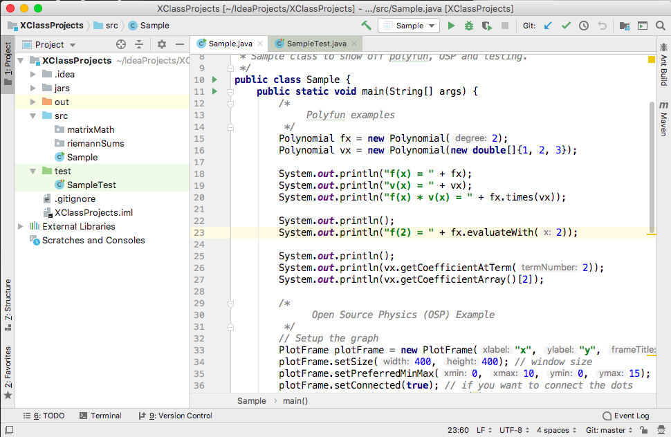

.. highlight:: java

Getting Started
=======================

Setup
------
Follow these images to set up your environment:

   **Step 1.** Open IntelliJ and select Check out from Version Control > Git.

   **Step 2.** Enter the url https://github.com/kjergens/ and select Clone.

   **Step 3.** The project should look like the above. (Note: the **out** folder will not appear until you've run a class.) Expand the **src** and **test** folders. These folders will contain all your code. 

Rust Removal
------------
For this section, you will review Quadratic equations, how to write objects and get introduced to writing test cases.

Problem: Find the roots of a Quadratic.
^^^^^^^^^^^^^^^^^^^^^^^^^^^^^^^^^^^^^^^^^^^

.. figure:: rustremoval01.png 
   :width: 50 %
   :align: center

The ``x`` values that make this function equal to ``0`` are the **roots** or **zeroes** of the function and can be found by using the **quadratic formula**.

.. figure:: rustremoval00.png 
   :width: 50 %
   :align: center

Step 1: Create a Test Class
^^^^^^^^^^^^^^^^^^^^^^^^^^^
.. admonition:: Exercise

  In the **test** folder of XClassProjects, create a new Java class called ``QuadraticTest``. At the top of the class, import all the necessary JUnit libraries, like this:

  .. code-block:: java 
   :linenos:

   import org.junit.Test;

   import static org.hamcrest.core.Is.is;
   import static org.junit.Assert.*;

  In the body of the ``QuadraticTest`` class, create a test method called ``getA``, like this:

  .. code-block:: java 

   @Test
   public void getA() {
      Quadratic q = new Quadratic(1, 2, 3);

      assertThat(q.getA(), is(1));
   }

  Run the test class. It will fail at first, which is expected.

Step 2: Create a Quadratic Object
^^^^^^^^^^^^^^^^^^^^^^^^^^^^^^^^^^^
.. admonition:: Exercise

   * In the **src** folder, create a new Java class called ``Quadratic``. This will be the object class that defines a quadratic function and methods that analyze its different characteristics.
   * Create 3 private attributes ``a``, ``b`` and ``c``, all doubles. 
   * Write a constructor which takes ``a``, ``b`` and ``c`` as params and sets the attributes ``a``, ``b`` and ``c``.
   * Write a ``getA`` method which returns the value of ``a``.
   * Run ``QuadraticTest`` again. It should succeed this time. 

Step 3: Add Methods and Test methods
^^^^^^^^^^^^^^^^^^^^^^^^^^^^^^^^^^^^

.. admonition:: Exercise

 `Note: For this exercise, you will switch back and forth between the **Quadratic** and **QuadraticTest** classes.` 

 Write the following methods in ``Quadratic``. For each method, write at least one test method in ``QuadraticTest``.

   ``public double getB()`` 
      * In ``Quadratic``, write a method to get the value of b.
      * Go back to ``QuadraticTest`` and add test method for ``getB``.
      * Do the same for ``getC``.

   ``public boolean realRoots()`` 
      * See if the quadratic has real roots, return boolean true or false. 
      * Write a test method in ``QuadraticTest`` called ``realRoots`` to test it .
   

   ``public int numberOfRoots()`` 
      * Determine the number of real roots, return an int (0, 1, or 2). 
      * Write a test method in ``QuadraticTest`` called ``numberOfRoots`` to test it .

   ``public double[] zeros()``
      * Find the roots, return 2 doubles (we put them in an array called zeros). 
      * Write a test method in ``QuadraticTest`` called ``zeros`` to test it .

   ``public double axisOfSymmetry()`` 
      * Find the axis of symmetry. Return that value. 
      * Write a test method in ``QuadraticTest`` called ``axisOfSymmetry`` to test it .

   ``public double extremeValue()``
      * Find the extreme value, the maximum or minimum function value corresponding to the y coordinate of the vertex of the parabola. Return that value. 
      * Write a test method in ``QuadraticTest`` called ``extremeValue`` to test it .

   ``public string maxOrMin()`` 
      * Is the extreme value a Max or a Min? Does the parabola opens up or down? Return a string, max or min. 
      * Write a test method in ``QuadraticTest`` called ``maxOrMin`` to test it .

   ``public double fof(double x)`` 
      * Evaluate the quadratic function at an x value, return f(that x value). 
      * Write a test method in ``QuadraticTest`` called ``fof`` to test it .

   When all of the tests pass, you are finished with this exercise.

Introduction to Polyfun
-----------------------

Open ``Sample.java`` and look at the Polyfun examples. (Ignore the rest of the code in ``Sample.java`` for now.) Run the code and look at the output in the Console. When you think you have an idea on how to make a Polynomial, complete the following exercise.

.. admonition:: Exercise

   Do the following in ``Sample.java``.

   * Create a Polynomial called ``gx`` and set it equal to ``(4.0)X^4 + 5.0``. Print the Polynomial.
   * Evaluate ``vx`` for when ``x`` is ``2`` and print the answer.
   * Add ``fx`` and ``vx`` and print the answer.
   * For ``vx``, print the coefficient for the ``X^1`` term (also known as simply X).
   * Use a ``for``-loop or ``for-each``-loop to print all the coefficients of ``vx``

For help, look at the `Polynomial JavaDocs <https://kjergens.github.io/polyfun-1.1.0/out/html/org/dalton/polyfun/Polynomial.html>`__.

Introduction to Open Source Physics (OSP)
------------------------------------------
