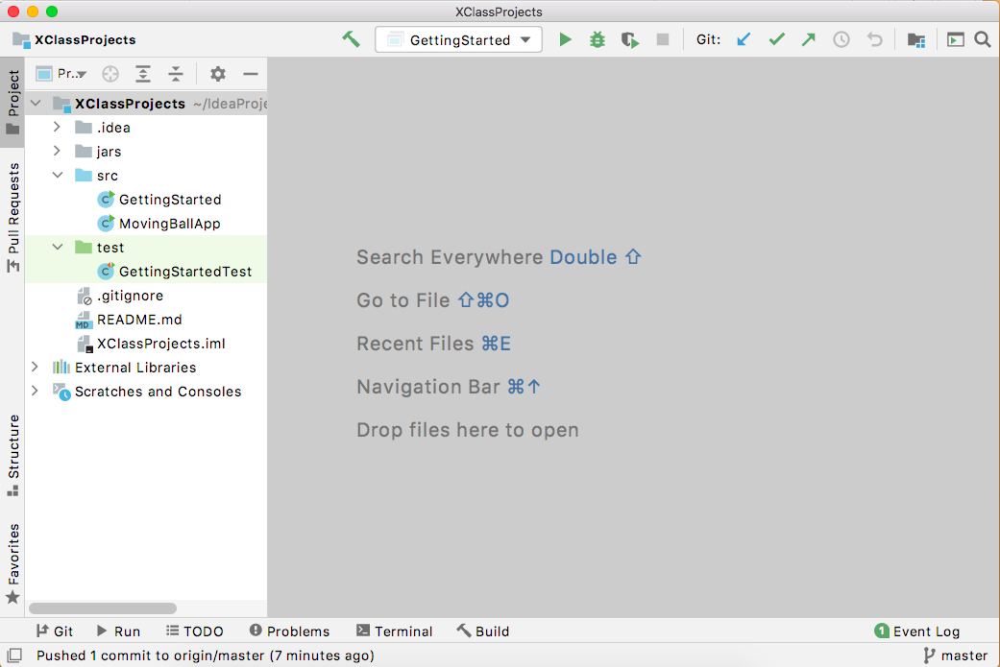

.. highlight:: java

Getting Started
=======================

Welcome to CSX
-----------------------

CSX, also know as Advanced Math and Physics Modelling, is three classes taught in a unified manner. The classes are Precalculus 2A, Physics A, and Computer Science X. In teaching Math and Physics in a unified way, we recognize the historical development of the two subjects. Math and Physics fit together like a hand in a glove. It’s most instructive, and most enjoyable, if the two subjects are presented in tandem. In teaching Math, Physics, and Computer Science in a unified way, we recognize the way in which contemporary scientists work. Whereas once all scientists were either experimentalists or theorists – and most were experimentalists – scientists are now increasingly engaged in the creation of computer models. This has become a third way in which to understand the physical world. Computer models are based upon an understanding of the relevant Math and Science. However, through the use of a computer, relatively simple Math and Science can be used to model extremely complicated situations. Consequently, computer models are ubiquitous in areas as disparate as Global Warming and the Human Genome.

Almost all Computer Science projects will be based on Physics or Mathematics. Some programs will be computer models of physical situations. For example, you’ll model balls dropping, planets orbiting the Sun, and masses connected to a spring. Some programs will be realizations of mathematical algorithms. For instance, early on in the year you’ll write code to invert a matrix.

When possible, the same topics will be covered at the same time in both Math and Physics. Many of the concepts covered in Precalculus and Physics were developed simultaneously. Math is necessary for a deep understanding of Physics, and Physics provides beautiful applications of what would otherwise be abstract Mathematics.

We certainly hope you enjoy Math, Physics and Computer Science this year. In particular, we hope you find it helpful to approach the three subjects as, in some sense, one. Throughout the class, you should try to think about the ways in which Math is used in Physics, the ways in which Physics allows for a deeper understanding of Mathematics, and the ways in which computers could be used to gain a deeper understanding of either Math or Physics. In addition, bear in mind that Math and Physics provide a limitless source of programming challenges. Consequently, Math and Physics provide an excellent context in which to teach programming concepts.

**Have a great year!**

Setup your Environment
-----------------------
Follow these images to set up your environment:

   **Step 1.** Open IntelliJ and select Check out from Version Control > Git.

.. figure:: setup01.png 
   :width: 100 %
   :align: left      

   **Step 2.** In the URL box enter https://github.com/kjergens/XClassProjects.git and select Clone.

   **Step 3.** Expand the **src** and **test** folders. These folders have example classes and are where you will put all your code for this course. Your project should now look like the above. (Note: the **out** folder will not appear until you've run a class.) 

Rust Removal
------------
For this section, you will review Quadratic equations, how to write objects and get introduced to writing test cases.

Problem: Find the roots of a Quadratic.
^^^^^^^^^^^^^^^^^^^^^^^^^^^^^^^^^^^^^^^^^^^

The ``x`` values that make this function equal to ``0`` are the **roots** or **zeroes** of the function and can be found by using the **quadratic formula**.

You are going to write a program that finds to roots (if they exist) for any quadratic equation.

Step 1: Create a Test Class
^^^^^^^^^^^^^^^^^^^^^^^^^^^
.. admonition:: Exercise

  In the **test** folder of XClassProjects, create a new Java class called ``QuadraticTest``. At the top of the class, import all the necessary JUnit libraries, like this:

  .. code-block:: java 
   :linenos:

   import org.junit.Test;

   import static org.hamcrest.core.Is.is;
   import static org.junit.Assert.*;

  In the body of the ``QuadraticTest`` class, create a test method called ``getA``, like this:

  .. code-block:: java 

   @Test
   public void getA() {
      Quadratic q = new Quadratic(1, 2, 3);

      assertThat(q.getA(), is(1));
   }

  If you need help, look at the ``GettingStartedTest`` class, in the **test** folder as an example.

  Run the QuadraticTest class. It will fail at first, which is expected.

Step 2: Create a Quadratic Object
^^^^^^^^^^^^^^^^^^^^^^^^^^^^^^^^^^^
In order to get your test to succeed, continue with the following exercise:

.. admonition:: Exercise

   #. In the **src** folder, create a new Java class called ``Quadratic``. This will be the object class that defines a quadratic function and methods that analyze its different characteristics.
   #. Create 3 private attributes ``a``, ``b`` and ``c``, all doubles. 
   #. Write a constructor which takes ``a``, ``b`` and ``c`` as params and useds them to set the ``a``, ``b`` and ``c`` attributes.
   #. Write a public method called ``getA`` which returns the value of ``a``.
   #. Run ``QuadraticTest`` again. It should succeed this time. 

Step 3: Add Methods and Test methods
^^^^^^^^^^^^^^^^^^^^^^^^^^^^^^^^^^^^

Once your ``QuadraticTest`` succeeds, continue with the following exercise:

.. admonition:: Exercise

 `Note: For this exercise, you will switch back and forth between the Quadratic and QuadraticTest classes.` 

 Write the following methods in ``Quadratic``. For each method, write at least one test method in ``QuadraticTest``.

 #. ``public double getB()`` 
      Return the value of b.
      In ``QuadraticTest`` and add test method for ``getB``.

 #. ``public double getC()`` 
      Return the value of c.
      In ``QuadraticTest`` and add test method for ``getC``.

 #. ``public boolean hasRealRoots()`` 
      See if the quadratic has real roots, return boolean true or false. 
      Write a test method in ``QuadraticTest`` called ``hasRealRoots`` to test it .
   

 #. ``public int numberOfRoots()`` 
      Determine the number of real roots, return an int (0, 1, or 2). 
      Write a test method in ``QuadraticTest`` called ``numberOfRoots`` to test it .

 #. ``public double[] getRootArray()``
      Find the roots, return 2 doubles (put them in an array). 
      Write a test method in ``QuadraticTest`` called ``getRootArray`` to test it .

 #. ``public double getAxisOfSymmetry()`` 
      Find the axis of symmetry. Return that value. 
      Write a test method in ``QuadraticTest`` called ``getAxisOfSymmetry`` to test it .

 #. ``public double getExtremeValue()``
      Find the extreme value, the maximum or minimum function value corresponding to the y coordinate of the vertex of the parabola. Return that value. 
      Write a test method in ``QuadraticTest`` called ``getExtremeValue`` to test it .

 #. ``public boolean isMax()`` 
      Is the extreme value a Max or a Min? Does the parabola opens up or down? Return true for Max and false for Min. 
      Write a test method in ``QuadraticTest`` called ``isMax`` to test it .

 #. ``public double evaluateWith(double x)`` 
      Evaluate the quadratic function at an x value, return f(that x value). 
      Write a test method in ``QuadraticTest`` called ``evaluateWith`` to test it .

 When ``QuadraticTest`` succeeds, you are finished with this exercise.

Introduction to Polyfun
-----------------------

Open the ``GettingStarted`` class and look at the Polynomial examples. (Ignore the rest of the code in the ``GettingStarted`` class for now.) Run the code and look at the output in the console. (Again, ignore the pop-up that appears for now.) 

After looking over the code and the output, complete the following exercise.

.. admonition:: Exercise

   Do the following in the ``GettingStarted`` class.

   #. Create a Polynomial called ``gx`` and set it equal to ``(4.0)X^4 + 5.0``. Print the Polynomial.
   #. Evaluate ``vx`` for when ``x`` is ``2`` and print the answer.
   #. Add ``fx`` and ``vx`` and print the answer.
   #. For ``vx``, print the coefficient for the ``X^1`` term (also known as simply X).
   #. Use a ``for``-loop or ``for-each``-loop to print all the coefficients of ``vx``

For help, look at the `Polynomial JavaDocs <https://kjergens.github.io/polyfun-1.1.0/out/html/org/dalton/polyfun/Polynomial.html>`__.

Introduction to Open Source Physics (OSP)
------------------------------------------

Step 1: Plot a Polynomial
^^^^^^^^^^^^^^^^^^^^^^^^^^^
Run the ``GettingStarted`` class again but this time look at the graph that appears. Hover over the graph for it to render. Look at the code under Open Source Physics (OSP) Example to see how this graph was made.

When you think you understand, do the following exercise:

.. admonition:: Exercise

   Do the following in the ``GettingStarted`` class.

   #. Use a ``for``-loop to change the red line to a graph of ``fx`` for when x is values 0 - 10.
   #. Use a ``for``-loop to change to change the green line to a graph ``vx`` for when x is values 0 - 10.
   #. Use a ``for``-loop to change the orange line to graph ``gx`` (which you created in the Introduction to Polyfun exercise).

   Which do you prefer, appending x and y plot points, or creating a Trail?

Step 2: Edit a Simple Animation
^^^^^^^^^^^^^^^^^^^^^^^^^^^^^^^^^^
Open and run the ``MovingBallApp``. This is an example of an animation. It is different from a static graph in that you have to write at least 3 methods (reset, intialize, and doStep) in order for it to work.

Familiarize yourself with the code, then do the following exercise.

.. admonition:: Exercise

   Do the following in the ``MovingBallApp`` class.

   #. Add code to let the user set the starting X position of the circle.
   #. Have the circle move in a diagonal across the screen, so as y decreases by 1, x simultaneously increases by 1.

Step 3: Create a new Animation (Random Walk)
^^^^^^^^^^^^^^^^^^^^^^^^^^^^^^^^^^^^^^^^^^^^
Now you'll create an animation from scratch. 

.. figure:: randomwalk.gif 
   :width: 30 %
   :align: center

.. admonition:: Exercise

   #. In the **src** folder, create a new Java class called ``RandomWalkApp``.
   #. Copy and paste the ``MovingBallApp`` class as starter code. Change the ``main`` method to run ``RandomWalkApp``.
   #. Change ``doStep`` so that ``circle`` randomly moves either 1 spot up, 1 spot down, or stays at the same y. It also randomly moves 1 spot left, 1 spot right or stays at the same x.
   #. Add 50 Circles that move in this way. 

     **HINT**: Change the global ``circle`` variable to an ``ArrayList`` of type ``Circle`` called ``circles``. 
     
     **HINT**: You'll need a ``for``-loop in ``initialize`` to add 50 Circles to ``circles``, a ``for-each``-loop in ``doStep`` to move each Circle in ``circles``, and, optionally, a ``for-each``-loop in ``stop`` to print how far each Circle in ``circles`` moved.

Step 4: (Advanced) Spiral Trail Animation
^^^^^^^^^^^^^^^^^^^^^^^^^^^^^^^^^^^^^^^^^^^

.. admonition:: Exercise

  `Note: You may choose to first make this a static graph, and then change it to an animated simulation.`

  #. In **src** folder, Create a new Java class called ``SpiralTrailApp``. The class should extend ``AbstractSimulation``.
  #. Create a rectangle using the ``DrawableShape.createRectangle()`` method like this:
    .. code-block:: java 

      DrawableShape rect = DrawableShape.createRectangle(double x, double y, double w, double h);
  #. Add the rectangle to a PlotFrame.
  #. On the PlotFrame draw a circle centered at each of the lattice points contained in the square whose lower left corner is (1,1) and upper right corner is (5,5). (There should be a total of 25 circles.) Make the radius of each circle correspond to twice its x-coordinate, and make each horizontal row a different color.
  #. On the PlotFrame draw a Trail that starts at the origin, (0,0), and “steps” outward in a spiral-like shape by first going to (1,0), then (1,1), ( − 1,1), ( − 1, − 1), (2, − 1), etc. The path should consist of 2 segments of length 1, then 2 segments of length 2, then 2 segments of length 3, etc. and the path turns 90° counter clockwise at the end of each segment. End the Trail at (4,4).

