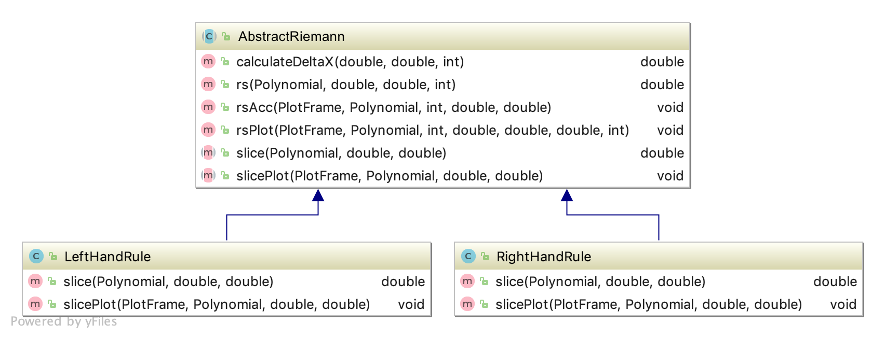

.. highlight:: java

Riemann Sum Assignment
======================

.. figure:: fig1.svg
   :width: 25 %
   :align: center

Approximating Area Under a Curve
--------------------------------

.. Gomp's original text:
.. A Riemann sum is, in almost all cases, only an approximation to the area
.. under a curve. We’ve seen this in math class. We’ve also seen that as the
.. width of the rectangles in a Riemann sum gets smaller the approximation
.. to the area under the curve improves. In some cases, we’ve been able to
.. use this fact to compute the exact value of the area under the curve. In
.. many cases, though, the sum is too complicated to be computed by hand.
.. This is where computers can be of help. For this project you’ll create a
.. Riemann class which evaluates a given Riemann sum.

The focus of this assignment will be defining and calculating
the area under a curve. The following slides, created by Dr. Gomprecht,
contain an introduction to the concept of **Riemann sums**, which
provide a way of approximating this area:

:download:`Area Under a Curve Slides </_static/RiemannSumSlides.pdf>`

We have seen that as the width of the rectangles in a Riemann sum gets smaller
the approximation to the area under the curve improves. In some cases, we’ve
been able to use this fact to compute the exact value of the area under the
curve. In many cases, though, the sum is too complicated to be computed by
hand.

This is where computers can be of help. Calculating a Riemann sum requires
adding up many small areas to get an approximation of the total area under the
curve. Computers are good at this kind of repetitive task: while there are many
steps, the calculation involved in each step is simple. In Compsci 1 and 2,
you learned how to tell a computer to do the same thing over and over using
``for`` and ``while``-loops. Now, you will apply this knowledge to create a
Java class which evaluates a given Riemann sum.

.. figure:: fig2.svg
   :width: 80 %
   :align: center

   The individual rectangles' areas can be added up using a ``for``-loop.
   The more iterations (steps) of the loop, the better the approximation.

.. admonition:: Exercise

   The syntax of ``for``-loops in Java can be hard to remember.

   * Use a ``for``-loop to print the first 100 positive integers.
   * Use a ``for``-loop to add up the first 100 positive integers.
   * Use a ``for``-loop and an array to find the mean of the following ten numbers:
     ``28.2, 14.7, 10.3, -2.0, 55.8, 10.3, 0.2, 1.0, 0.0, 25.1``

Classes and Methods
-------------------

You will create several classes for this assignment: a base class called
``Riemann`` and then child classes for each of the Riemann sum rules.

The Riemann Class
^^^^^^^^^^^^^^^^^

The first class which you will create for this assignment, ``Riemann``, will
contain the majority of your code for calculating Riemann sums. Start by
`opening up the documentation
</_static/riemann-javadoc/riemannsum/Riemann.html>`_ for ``Riemann``. The
linked page, known as a **JavaDoc**, has information about each of the methods
of the ``Riemann`` class. This includes the methods' **parameters** (inputs)
and their **return values** (outputs). Your job will be to create a class
which conforms to the given JavaDoc---the ``Riemann`` class which you create
should contain each of the listed methods, and each method should behave as
described in the JavaDoc, taking in the same parameters and outputting the
same type of return value.

.. note::
   Java programmers frequently use **JavaDocs** to document their code so that
   other people can understand what it does. For example, Dr. Gomprecht used
   JavaDocs while creating Polyfun so that you know how to use the methods
   in ``Polynomial`` and other classes in the library. JavaDocs are created by
   writing comments in your source code using a specific format; you can find a
   good introduction to documenting your code in this way at https://alvinalexander.com/java/edu/pj/pj010014.

.. Regardless of the rule,
.. calculating a Riemann sum inevitably involves adding together the area of all
.. of the individual slices. So, that leaves a few options for how to structure
.. this project. For this assignment, you will write an **abstract class** which
.. several child classes, each corresponding to a different rule, extend. Using
.. class inheritance in order to structure this project enables you to avoid
.. writing redundant code.

Abstract Classes and Methods
^^^^^^^^^^^^^^^^^^^^^^^^^^^^

The ``Riemann`` class, as shown in the JavaDoc, contains a keyword which you
most likely have not yet encountered: ``abstract``. This keyword will allow
you to use to use **object-oriented programming (OOP)** to organize your code
in a more logical way.

You have learned that there are several different rules which can be used to
calculate Riemann sums, such as the left hand rule, right hand rule, and
trapezoid rule. Thinking of a Riemann sum as the sum of many small slices of
the total area, these rules correspond to different ways of defining the
slices. However, the overall method for calculating a Riemann sum remains the
same; given the endpoints of the interval on which to calculate the sum and
the number of slices, the calculation can always be divided into the following
steps:

#. Calculate :math:`\Delta x` from the endpoints of the interval and the number
   of slices.
#. Determine the endpoints of each subinterval.
#. Calculate the area of each slice.
#. Add up the areas to find the total area.

Notice that only the third step depends upon the specific rule being
used; the others are the same regardless of the rule.

.. figure:: fig3.svg
   :width: 95 %
   :align: center

   Here, three different rules are being used to calculate the same Riemann sum.
   While slices' shapes are different, they exist over the same subintervals in
   each diagram.

.. At the top of the JavaDoc for ``Riemann`` is its **class declaration**, the
.. line which denotes that a new class is being created: ::

..     public abstract class Riemann

.. The ``public`` and ``class`` keywords should look familiar, as you've used
.. them to declare classes in Compsci 1 and 2. However, ``abstract`` is probably
.. new to you. The ``abstract`` keyword declares that ``Riemann`` is an
.. **abstract class**. Abstract classes are special in that they cannot be
.. instantiated---in other words, you can never call ``new Riemann()``. This may
.. seem to make abstract classes useless, since there is no way to directly
.. construct an object of one.

.. While trying to instantiate an abstract class causes a compiler error, it is still possible to create
.. a ``Riemann`` object by first creating a subclass.

.. admonition:: TODO

   Finish this section! figure out how we're explaining abstract classes and subclasses

.. An abstract class is never instantiated, which is why it's called "abstract."
.. This type of class is used in situations where you want several associated
.. classes to share certain methods.

.. Abstract methods are declared similarly to normal methods. However, they do
.. not have a method body (the part of a method that is contained in curly
.. braces).

.. You will be given the Javadoc for an abstract class below. Using this
.. documentation, you should fill in the methods as specified in order to meet
.. the requirements.

.. **LINK TO DOCUMENTATION**

.. In each child class of **Riemann** you will write a different **slice** and
.. **slicePlot** method.

Assignment
--------------

Base Assignment
^^^^^^^^^^^^^^^

#. Write the ``Riemann`` abstract class based on the provided `JavaDoc </_static/riemann-javadoc/riemannsum/Riemann.html>`_.
#. Write ``RightHandRule``, ``LeftHandRule``, and ``TrapezoidRule``, each
   extending **Riemann**.
#. Use your program to answer the following question: which of the three rules
   is the most accurate?

.. warning:: Remember to account for the following edge cases:

   * The value of the polynomial for a given :math:`x` is negative.
   * The left endpoint is greater than the right endpoint.

Extension
^^^^^^^^^

The three Riemann sum rules which you have seen so far (the right hand rule,
left hand rule, and trapezoid rule) tend to yield good approximations of the
area under a curve provided that :math:`\Delta x` is small enough. However,
they are not the only rules.

For your extension, research different Riemann sum rules and write classes for
them in the same style as the base assignment. Below are some suggested
extensions that students have done in the past:

* **Maximum rule**
* **Minimum rule**
* **Random rule**
* **Midpoint rule**
* **Simpson's rule** - this is more involved than the other options but
  is also the most interesting---and often gives better approximations. It
  will take some outside research.

There is also the option to create a command-line **user interface** which
makes it easier to learn from your program. Even if you decide not to dedicate
a lot of time to making an interface, you should at least have some way for a
user to run your program with desired parameters without having to directly
edit the code first.
